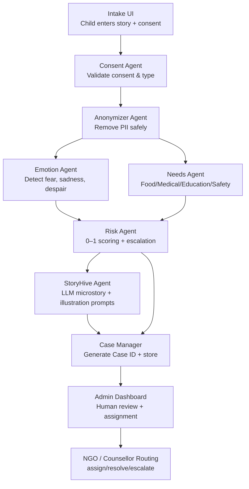

# HopeChain — AI-Powered Compassion Workflow

A Multi-Agent Ethical AI System for Safe Child Testimony Processing  
Built for SYNERGY'25 — Creative Media Co-Pilot: Neural.Net Hackathon

## Overview

HopeChain is a multi-agent AI workflow designed to safely process children's testimonies during humanitarian crises.

**Watch the Demo:** [HopeChain Demo Video](https://youtu.be/OjCRgUQObVE?si=wc2CuhcLyXVhq03t)

It ensures:

- Ethical & safe data handling
- Automatic anonymization (name, phone, addresses, sensitive identifiers)
- Emotion detection & crisis risk scoring
- Needs classification (food, safety, medical, education, shelter)
- Microstory generation using LLM-based narrative agent
- Human-in-the-loop support routing
- Consent-first architecture (DPDP compliant)
- PDF case reports for NGOs & relief teams

HopeChain simulates a team of AI agents working together:

| Agent | Role |
|-------|------|
| SAFETY AGENT | Removes PII, flags dangerous text |
| EMOTION AGENT | Detects sentiment, intensity, critical phrases |
| RISK SCORING AGENT | Computes threat level & recommended actions |
| STORY AGENT | Generates empathetic microstory (LLM) |
| REPORT AGENT | Creates text-only case PDF |
| ORCHESTRATOR | Connects all agents end-to-end |

## Key Features & Architecture

HopeChain fully demonstrates collaborative agentic AI:

- Multiple AI agents collaborate (safety → emotion → needs → story → risk → report)
- Uses structured agent communication (data is passed using Pydantic models)
- Uses open-source models only (Phi-3.5 for LLM microstory; regex/NLP for others)
- Ensures ethics, legality, brand-style consistency
- Generates creative narrative microstories while enforcing compliance
- Perfectly demonstrates multi-agent governance, validation & role specialization

This is NOT a single API call project — it is an orchestrated, multi-agent pipeline.

## Tech Stack

### Backend – FastAPI

- Python FastAPI
- Multi-agent orchestration
- Pydantic models
- PDF generation (ReportLab)
- In-memory CaseStore

### Frontend – Streamlit

- Intake interface (demo)
- Consent workflow
- Admin Dashboard for case triage

### AI / NLP

- Open-source phi-3.5 LLM (via Ollama)
- Custom regex-based anonymizer
- Rule-based emotion & risk classifier
- Needs classifier (lightweight NLP)

## Project Structure

```
hopechain/
│
├── backend/
│   ├── main.py                # Main multi-agent backend
│   ├── schemas.py             # Pydantic models
│   └── requirements.txt
│
├── frontend/
│   ├── app.py                 # User-facing intake UI
│   ├── admin_dashboard.py     # NGO dashboard (assign, escalate, resolve)
│   └── requirements.txt
|
└── README.md                  # Documentation
```

## Setup Instructions

### 1. Clone the repo

```bash
git clone https://github.com/sri-sruthi/hopechain.git
cd hopechain
```

### Backend Setup (FastAPI + Agents)

### 2. Create a virtual environment

```bash
python3 -m venv venv
source venv/bin/activate  # Mac/Linux
venv\Scripts\activate     # Windows
```

### 3. Install backend dependencies

```bash
cd backend
pip install -r requirements.txt
```

### 4. Install Ollama + phi-3.5 (open-source LLM)

Install Ollama: https://ollama.com/download

Pull the model:

```bash
ollama pull phi3.5
```

### 5. Run the backend server

```bash
uvicorn main:app --reload
```

Backend runs at: **http://127.0.0.1:8000**

Check health: `GET /`

## Frontend Setup

Open a second terminal.

### 6. Install Streamlit frontend dependencies

```bash
cd frontend
pip install -r requirements.txt
```

### 7. Run the intake UI

```bash
streamlit run app.py
```

Runs at: **http://localhost:8501**

### 8. Run the Admin Dashboard (NGO Panel)

```bash
streamlit run admin_dashboard.py
```

Runs at: **http://localhost:8502**

## How the Multi-Agent Pipeline Works




### 1. Intake Agent
- Receives story + consent
- Validates
- Sends text to next agent

### 2. Safety Agent
- Removes names, contacts, addresses
- Detects sensitive words
- Produces SafetyResult

### 3. Emotion Agent
- Token-level emotion mapping
- Phrase-based suicide/self-harm detection
- Outputs emotional intensity & support type

### 4. Needs Agent
- Categorizes: food, safety, medical, education, shelter

### 5. Risk Agent
- Computes risk score (0–1)
- Generates recommended action (NGO routing)

### 6. Story Agent
- Uses phi-3.5 to create a microstory
- Keeps redacted names protected

### 7. Report Agent
- Generates a downloadable PDF

### 8. CaseStore Agent
- Saves case in memory
- Used by Admin Dashboard

This fully satisfies the hackathon's multi-agent requirement.

## Ethics & Safety

HopeChain ensures:

- Explicit consent required
- Guardian consent supported
- DPDP-compliant data handling
- Only anonymized text stored unless allowed
- High-risk cases flagged
- Human-in-the-loop for all escalations

## Future Extensions

- Multi-language support
- Fine-tuned emotion/risk model
- AI counsellor chatbot
- NGO routing engine with region/language filters
- Secure cloud deployment

## Project Deliverables

This repo includes:

- Clean structured code
- Full documentation
- Clear installation & execution steps

## Why HopeChain Matters

In humanitarian crises, children's voices are often the most vulnerable and the most urgent. Yet their testimonies contain sensitive information that must be protected while still being heard and acted upon.

HopeChain bridges this critical gap. It's not just a technical demonstration—it's a blueprint for how AI can serve humanity's most vulnerable populations with dignity, privacy, and compassion.

Every line of code in this system asks: "How can technology amplify a child's voice without exposing them to further harm?"

By combining multi-agent collaboration, ethical AI governance, and privacy-first architecture, HopeChain demonstrates that powerful AI systems can be both intelligent and compassionate. This project proves that we can build technology that protects while it processes, that understands while it anonymizes, and that scales empathy without sacrificing safety.

HopeChain is our contribution to a future where AI doesn't just process data—it protects people.
